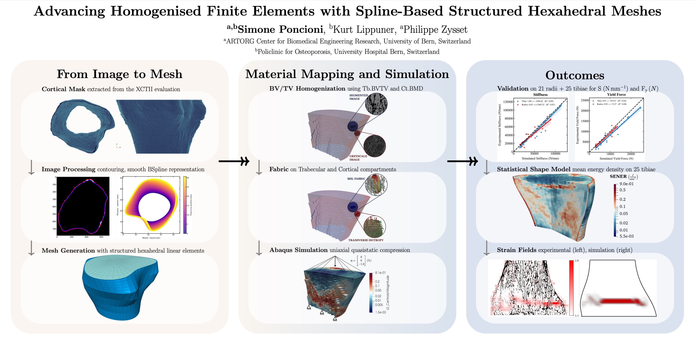

# Homogenised Finite Elements (HFE) pipeline


[](https://zenodo.org/doi/10.5281/zenodo.13629159)


👷🏼 Simone Poncioni <br> 🦴 Musculoskeletal Biomechanics Group<br> 🎓 ARTORG Center for Biomedical Engineering Research, University of Bern


## 📝 Introduction

We present a robust and efficient standalone homogenised finite element pipeline from HR-pQCT clinical imaging data. Traditional voxel-based meshing techniques often struggle to accurately represent the complex geometry of cortical bone, leading to suboptimal mechanical simulations. To address this, our method leverages a smooth representation that significantly enhances the precision of cortical shell modeling, outperforming monophasic isotropic voxel-based meshes. By generating structured meshes, our approach ensures greater efficiency, reduced memory usage, and improved comparability across different patients or longitudinal studies. The algorithm integrates advanced image processing techniques, including contour extraction, BSpline smoothing, and mesh optimization, to produce high-quality meshes that accurately capture both cortical and trabecular compartments.

## 💡 Method




## 🔧 Installation

### Building Dependencies

This project uses Docker to manage its dependencies. To build the Docker image, follow these steps:

1. Install Docker on your machine if you haven't already. You can download it from [here](https://www.docker.com/products/docker-desktop).

2. Navigate to the project directory that contains the Dockerfile. In this case, it's the `02_CODE` directory.

```sh
cd 02_CODE
```

1. Build the Docker image using the Dockerfile.ubuntu24.04 file. Replace your_image_name with the name you want to give to your Docker image.

```sh
docker build -t your_image_name -f Dockerfile.ubuntu24.04 .
```

### Running the Docker Image

After building the Docker image, you can run it using the following command:

```sh
docker run -it your_image_name
```

This will start a Docker container with the built image and open an interactive shell in the container. The Docker container has all the dependencies installed and the environment set up as specified in the Dockerfile.

### Running the Project

Once you're inside the Docker container, you can run the project. The exact command depends on how your project is structured, but it will generally look something like this:

```sh
conda init
source .bashrc
conda activate hfe-essentials
cd 02_CODE
python src/pipeline_runner.py
```

### Building the Docker image in Apptainer

When working on HPC, it might be necessary to run the container in Apptainer. You can pull the Docker image directly from Docker Hub:

```sh
apptainer build --sandbox hfe_development.sif docker://simoneponcioni/hfe_development:latest
```

Once it's downloaded, run it following these steps:

### Work interactively

Submit an interactive SLURM job and then use the shell command to spawn an interactive shell within the Singularity container:

```sh
srun --time=01:00:00 --mem-per-cpu=2G --pty bash
apptainer shell <image>
```

### Execute the containers “runscript”

```sh
#!/bin/bash
#SBATCH --partition=all
#SBATCH --mem-per-cpu=2G

apptainer run <image>   #or ./<image>
```

### Run a command within your container image

```sh
apptainer exec <image> <command>

e.g:
apptainer exec container.img cat /etc/os-release
```

### Bind directories

Per default the started application (e.g. cat in the last example) runs withing the container. The container works like a seperate machine with own operation system etc. Thus, per default you have no access to files and directories outside the container. This can be changed using binding paths.

If files are needed outside the container, e.g. in your HOME you can add the path to APPTAINER_BINDPATH="src1[:dest1],src2[:dest2]. All subdirectories and files will be accessible. Thus you could bind your HOME directory as:

```sh
export APPTAINER_BINDPATH="$HOME/:$HOME/"   
# or simply 
export APPTAINER_BINDPATH="$HOME"
```
